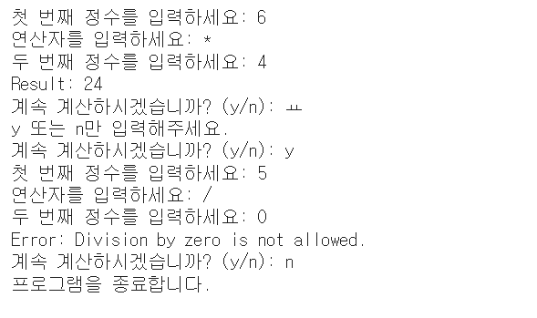
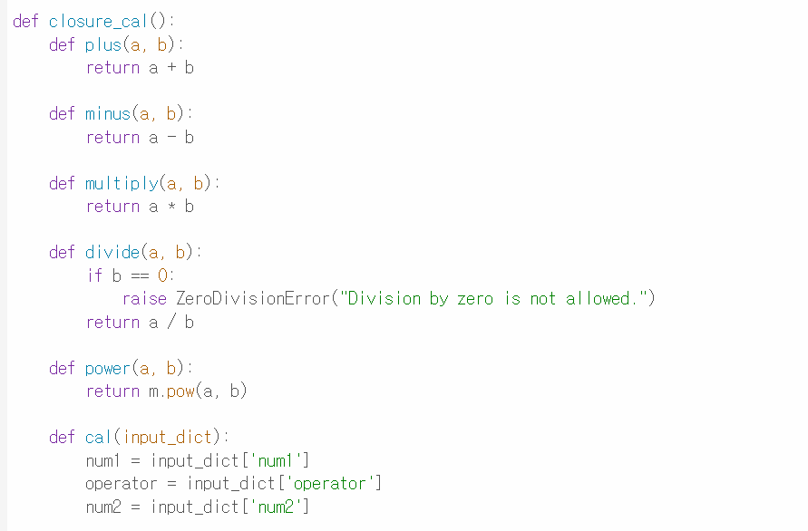
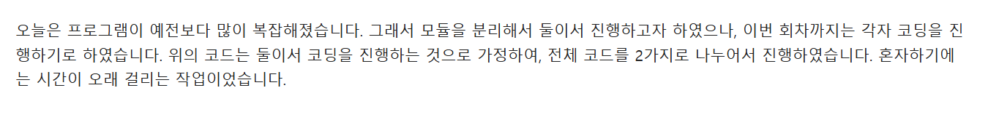

# AIFFEL_quest_cr
# AIFFEL Campus Online Code Peer Review Templete
- 코더 : 권중
- 리뷰어 : 최유진


# PRT(Peer Review Template)
- [X]  **1. 주어진 문제를 해결하는 완성된 코드가 제출되었나요?**
    - 문제에서 요구하는 최종 결과물이 첨부되었는지 확인
       네. 문제를 해결하는 완성된 코드가 제출되었습니다. 
    
    
- [x]  **2. 전체 코드에서 가장 핵심적이거나 가장 복잡하고 이해하기 어려운 부분에 작성된 
주석 또는 doc string을 보고 해당 코드가 잘 이해되었나요?**
    깔끔하게 코드를 짠 설명대로 주석을 달아 잘 이해되었다.
    목차로 설명한 부분도 좋음
    #데이터를 입력받는 부분 - (1) 오류처리
    #사칙연산을 실행하는 부분 - (2) 클로저 사용
    
    
        
- [X]  **3. 에러가 난 부분을 디버깅하여 문제를 해결한 기록을 남겼거나
새로운 시도 또는 추가 실험을 수행해봤나요?**
    
    에러 기록은 없었다. 클로저를 사용해 수업시간에 배운 것을 응용한 것이 제일 기억에 남음!
        
        
- [x]  **4. 회고를 잘 작성했나요?**
    - 주어진 문제를 해결하는 완성된 코드 내지 프로젝트 결과물에 대해
    배운점과 아쉬운점, 느낀점 등이 기록되어 있는지 확인
    - 전체 코드 실행 플로우를 그래프로 그려서 이해를 돕고 있는지 확인
        - 중요! 잘 작성되었다고 생각되는 부분을 캡쳐해 근거로 첨부
        
        회고를 잘 작성하였다.


# 회고(참고 링크 및 코드 개선)
```
# 리뷰어의 회고를 작성합니다.
# 코드 리뷰 시 참고한 링크가 있다면 링크와 간략한 설명을 첨부합니다.
# 코드 리뷰를 통해 개선한 코드가 있다면 코드와 간략한 설명을 첨부합니다.
 혼자서 하셨다니 대단하다... 근데 코드를 좀 더 줄일수 있는 방법이 있을 것 같다!
```
